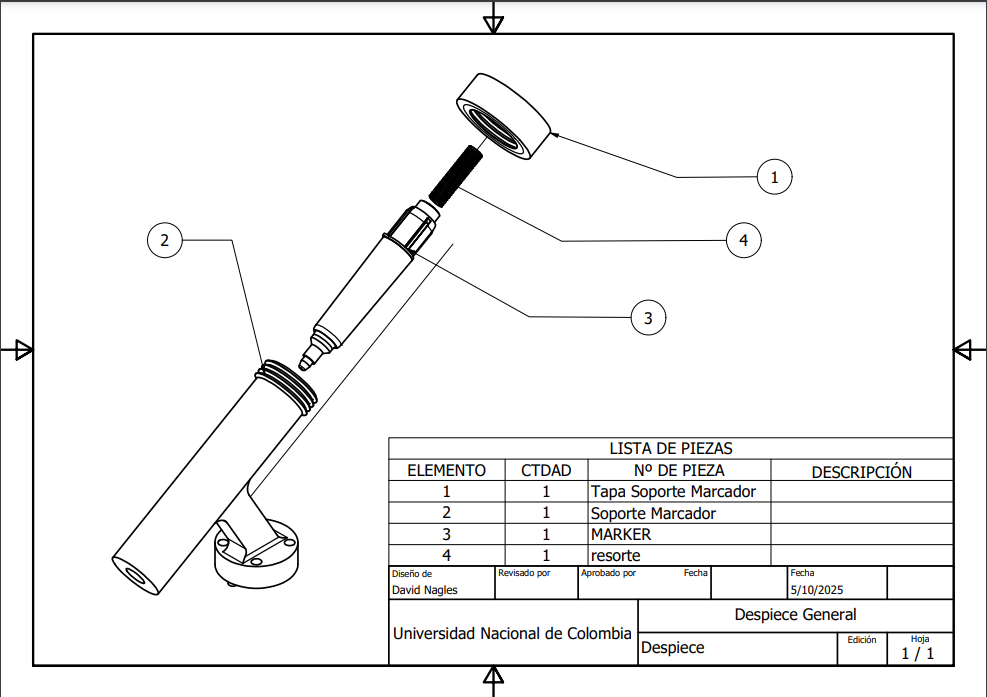
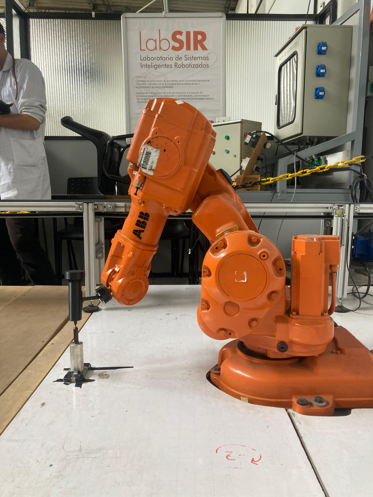
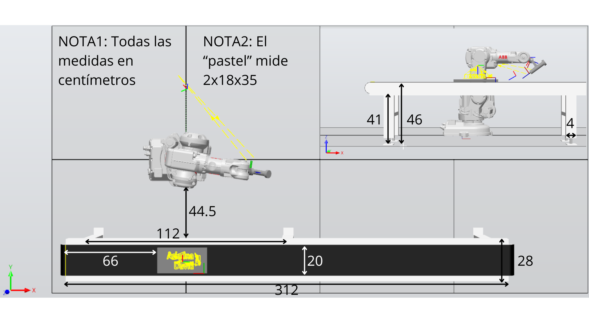
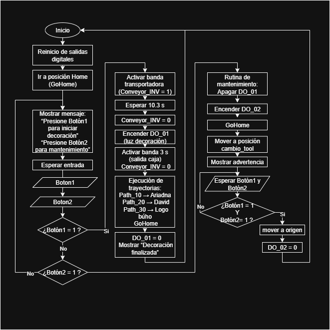

# Lab1_Robotica_David_Ariadna
Proyecto de laboratorio de Robótica Industrial (UNAL 2025-II): programación de un robot ABB IRB140 en RAPID con control de entradas/salidas digitales, simulación en RobotStudio y ejecución en robot real.

# 🤖 Laboratorio No. 01 – Robótica Industrial 2025-II
**Autores:** Ariadna Contreras Nossa y David Santiago Nagles Barajas <br>
**Universidad Nacional de Colombia**  
**Asignatura:** Robótica Industrial  

---

## 🎥 Video del proceso


A continuación se deja el link al video del funcionamiento que contiene: <br>
+ Simulación en Robot Studio de rutina de decoración con un solo pastel.<br>
+ Simulación en Robot Studio de rutina de decoración con dos pasteles, ejercicio de cambio de cuadrante.<br>
+ Rutina de decoración del Robot en la vida real.<br>

🎥 [Ver video completo en YouTube](https://youtu.be/ocZAAM295cw)

---

## 🧱 Descripción del Proyecto
Este laboratorio consiste en la programación y control de un **robot ABB IRB 140** para simular la **decoración de una torta**, donde el robot escribe los nombres *Ariadna* y *David* junto con un logo de búho.  
El proyecto incluye:
- Programación en **RAPID** para tres trayectorias (`Path_10`, `Path_20`, `Path_30`).
- Control de una **banda transportadora** con lógica I/O.
- Implementación de **dos botones físicos** (inicio y mantenimiento).
- Señales digitales de **luces indicadoras** y rutina de retorno a home con verificación articular a 0°.
- Simulación en **RobotStudio** y ejecución en robot real.

---

## 🧰 Herramienta
La herramienta fue diseñada para sostener un marcador fijo al flange del robot.  
Se calibró su **Tool Center Point (TCP)** y se importó el modelo CAD a RobotStudio para comparar el tooldata real y virtual.

La herramienta se compone de tres partes principales modeladas en CAD y exportadas en formato `.SAT` para su importación a RobotStudio:

📷  


- [📎 Herramienta_Soporte_Marcador](Docs/Herramienta_Soporte_Marcador.pdf) — estructura principal que sostiene el marcador.
- [📎 Herramienta_Tapa_Marcador](Docs/Herramienta_Tapa_Marcador.pdf) — tapa de sujeción del plumón.
- [📎 Herramienta_Despiece](Docs/Herramienta_Despiece.pdf) — vista general con medidas y ensamble.
- [📎 Herramienta_Soporte.sat](Docs/Herramienta_Soporte.sat) — modelo 3D exportado para RobotStudio.



  
📷  


### 🎯 Calibración del TCP

Se realizaron **dos procedimientos de calibración física** y una **verificación en RobotStudio**:

1. **Calibración TCP Manual:**  

   Se aplicó el método de **cuatro puntos**, logrando una mayor precisión al determinar el offset de la herramienta.
   
   
   

3. **Calibración en RobotStudio:**  
   El resultado fue validado en el entorno virtual. Se considera aceptable para aplicaciones de trazado y escritura. Al final se tomo la decisión de usar la calibración del simulador.

   
   
---

## 🗺️ Plano de planta
Incluye:
- Posición del robot ABB IRB140  
- Banda transportadora  
- Caja de cartón paja (2×18×35 cm)  
- Zona de trabajo delimitada con el workobject.

📄 Ver imagen:



---

## 🔁 Diagrama de flujo
Representa la secuencia de eventos del programa principal, manejo de entradas, salidas y rutinas de mantenimiento.  
📄 Ver: 



---


## ⚙️ Lógica y señales digitales

El sistema se controla Mediante dos entradas digitales y dos salidas:

- **DI_01:** Botón de inicio de rutina de decoración  
- **DI_02:** Botón de rutina de mantenimiento  
- **DO_01:** Luz indicadora de proceso activo  
- **DO_02:** Luz indicadora de mantenimiento  

Además, se controló la **banda transportadora** a través de la salida `Conveyor_INV`.

La lógica completa fue programada en RAPID usando condicionales `IF–ELSEIF–ENDIF` y bucles `WHILE TRUE`.


**Resumen del funcionamiento:**
1. Al presionar **Botón 1**, se activa la banda, se realiza la decoración (Paths 10, 20, 30) y se vuelve a home.  
2. Al presionar **Botón 2**, el robot entra en modo mantenimiento, encendiendo la luz DO_02.  
3. Al finalizar, ambas rutinas devuelven el robot a la posición `GoHome` con verificación de 0° en cada eje.

---

## 🧩 Código principal (`Module3_final.mod`)
El código incluye:
- Ciclo principal con condicionales `IF ... ELSEIF ... ENDIF`
- Función `GoHome()` que valida si todas las articulaciones están a 0°.
- Rutinas `Path_10`, `Path_20`, `Path_30` para escribir los nombres y logo.
- Señales digitales y control de banda.
📄 Ver el archivo completo aquí: [simulation/Module3_final.mod](simulation/Module3_final.mod)

## 🧩 Código Secundario (`Module3_con_reflejo.mod`)
- Código del reflejo que se hace a la trayectoria reutilizando los targets creados previamente, en una Rutina que se llama `Path_40`.

📄 Ver el archivo completo aquí: [simulation/reflejo](simulation/reflejo/Module3_con_reflejo)

---
## 🧩 Descripción de las funciones utilizadas

El programa fue desarrollado en lenguaje **RAPID** para el robot ABB IRB 140, organizando su lógica en procedimientos (`PROC`) que gestionan los movimientos, entradas y salidas digitales, y rutinas de seguridad.  
A continuación, se describen las principales funciones implementadas en el módulo:

---

### 🔹 `PROC main()`

Es el **procedimiento principal** que controla el flujo del programa.  
Contiene la lógica de operación continua mediante un bucle `WHILE TRUE DO`, permitiendo la interacción con el operario a través de botones físicos.

**Funciones principales:**
- Inicializa y reinicia todas las salidas digitales (`Reset Conveyor_FWD`, `Reset DO_01`, etc.).  
- Llama a `GoHome` para asegurar que el robot inicie desde una posición segura.  
- Muestra mensajes en el FlexPendant (`TPWrite`) para guiar al usuario.  
- Evalúa el estado de los botones:
  - **DI_01 = 1, DI_02 = 0:** ejecuta la **rutina de decoración**.  
  - **DI_01 = 0, DI_02 = 1:** ejecuta la **rutina de mantenimiento**.  
- Controla la **banda transportadora** con `Set Conveyor_INV` y tiempos de espera (`WaitTime`).  
- Activa y apaga las **luces indicadoras** (`DO_01` y `DO_02`) según la rutina activa.  
- Ejecuta las trayectorias `Path_10`, `Path_20` y `Path_30` (decoración de nombres y logo).  
- Al finalizar, llama nuevamente a `GoHome` para garantizar la posición articular de referencia.

> En conjunto, `main()` actúa como el **controlador maestro del sistema**, coordinando todos los procesos del laboratorio.

---

### 🔹 `PROC GoHome()`

Verifica si el robot se encuentra en la **posición articular home** (todas las articulaciones ≈ 0°).  
Si alguna articulación está fuera de la tolerancia (`0.2°`), el robot se mueve a la posición `HOME_Origen`.

**Instrucciones destacadas:**
- `CJointT()` obtiene la posición articular actual.  
- Comparaciones `IF–ELSE` verifican cada eje dentro del margen permitido.  
- `MoveAbsJ` ejecuta el retorno automático a la posición de home.

**Propósito:**  
Garantizar que cada rutina empiece y termine en una posición segura, previniendo errores cinemáticos o posibles colisiones.

---

### 🔹 `Path_10`, `Path_20` y `Path_30`

Corresponden a las **trayectorias de decoración**, generadas en RobotStudio a partir de Smart Components.

| Trayectoria | Descripción | Observación |
|--------------|--------------|--------------|
| `Path_10` | Escribe el nombre **Ariadna** | Movimiento lineal continuo |
| `Path_20` | Escribe el nombre **David** | Rotación de TCP ≈ 20° |
| `Path_30` | Dibuja el **logo del búho** | Trayectoria curva y más extensa |

Durante la ejecución:
- Se usa `MoveL` para trazos lineales precisos y `MoveAbsJ` para desplazamientos rápidos.  
- Se mantienen velocidades entre **v100 y v1000** y una zona de precisión máxima de **z1**.  
- El TCP rotado 20° permite cubrir el área del logo y del texto sin colisiones.

**Propósito:** reproducir el proceso de decoración automatizada sobre la superficie de la caja de cartón paja.

---

### 🔹 Señales digitales (Entradas / Salidas)

El sistema integra control de **entradas (DI)** y **salidas (DO)** para la interacción física y visual con el entorno.

| Tipo | Señal | Función |
|------|--------|----------|
| Entrada | `DI_01` | Botón de inicio de rutina de decoración |
| Entrada | `DI_02` | Botón de rutina de mantenimiento |
| Salida | `DO_01` | Luz indicadora de proceso activo |
| Salida | `DO_02` | Luz indicadora de modo mantenimiento |
| Salida | `Conveyor_INV` | Control del movimiento de la banda transportadora |

**Instrucciones usadas:**
- `Set` → activa una salida digital.  
- `Reset` → apaga una salida digital.  
- `WaitUntil` → pausa el flujo hasta que se cumpla una condición (por ejemplo, ambos botones presionados).  
- `TPWrite` → muestra mensajes en la pantalla del FlexPendant.

---

### 🔹 Instrucciones RAPID destacadas

| Instrucción | Descripción |
|--------------|-------------|
| `MoveAbsJ` | Movimiento articular absoluto (por articulaciones). |
| `MoveL` | Movimiento lineal en el espacio cartesiano. |
| `WaitTime` | Pausa temporal definida en segundos. |
| `TPWrite` | Mensaje en pantalla del FlexPendant. |
| `Set` / `Reset` | Activación o apagado de señales digitales. |
| `WaitUntil` | Espera una condición lógica verdadera. |
| `IF / ELSEIF / ENDIF` | Control condicional del flujo del programa. |
| `WHILE TRUE DO` | Bucle continuo que mantiene activo el sistema. |
| `CJointT()` | Obtiene la posición articular actual del robot. |

---

### 🔹 Estructura general del código
```text
main()
├── GoHome()
├── IF DI_01 → Rutina de Decoración
│ ├── Control de banda (Conveyor_INV)
│ ├── Activación de luz DO_01
│ ├── Ejecución de Path_10, Path_20, Path_30
│ └── GoHome()
├── ELSEIF DI_02 → Rutina de Mantenimiento
│ ├── GoHome()
│ ├── Movimiento a cambio_Tool
│ ├── Activación de luz DO_02
│ ├── Espera de seguridad (WaitUntil)
│ └── Retorno a HOME_Origen
└── ENDWHILE
```
---

### ✅ **Conclusión técnica**

El módulo desarrollado integra:
- Control de **movimiento y trayectorias** en RAPID.  
- Manejo de **entradas y salidas digitales** (I/O físicas).  
- **Rutinas seguras** de mantenimiento y retorno a home.  
- Coordinación completa entre **simulación en RobotStudio** y **ejecución en el robot real**.

Este enfoque modular cumple con los objetivos del laboratorio, garantizando precisión, seguridad y facilidad de control desde el FlexPendant.

## 🧩 Archivos incluidos
| Archivo | Descripción |
|----------|-------------|
| `Module3_final.mod` | Código RAPID completo |
| `Plano_de_planta.png` | Distribución de elementos |
| `Diagrama_de_flujo.png` | Flujo de acciones del robot |
| `video_lab.mp4` | Video de simulación + robot real |
| `Laboratorio_No_1.pdf` | Enunciado del laboratorio |
| `Resultado final.jpg` | Decorado final sobre la caja |

---

## 🏁 Conclusiones

- Se logró integrar exitosamente el control de **entradas y salidas digitales** en un robot ABB IRB 140.  
- El sistema replica un entorno industrial básico de decoración automatizada con control de banda y luces.  
- La calibración del TCP fue validada en RobotStudio, garantizando precisión en los trazos.  
- La simulación coincidió con la implementación física, mostrando coherencia entre el entorno virtual y real.


